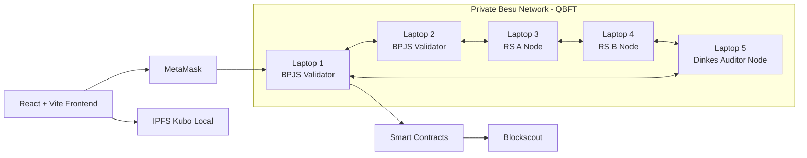
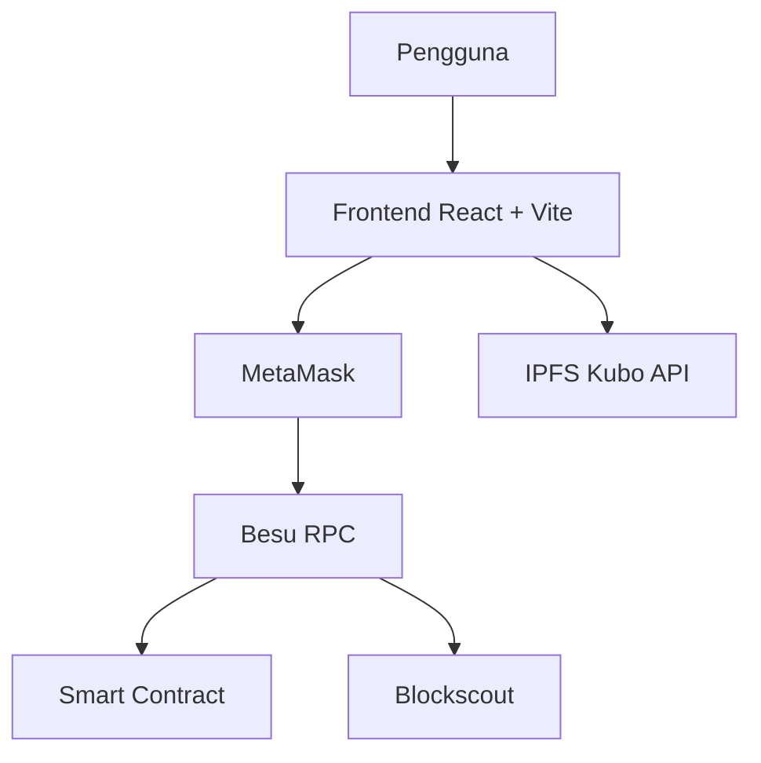
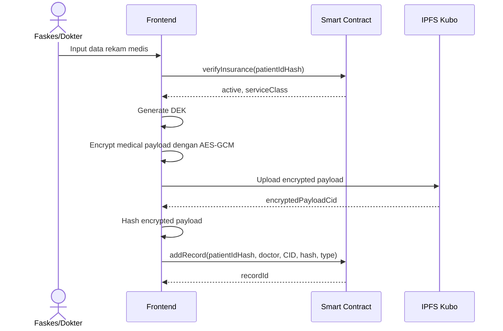
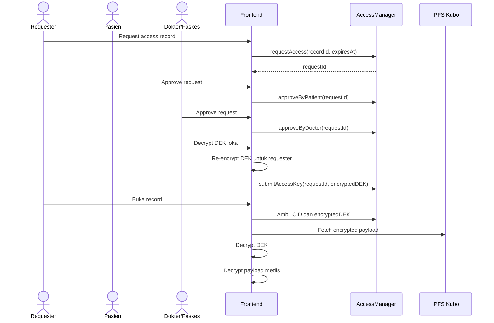
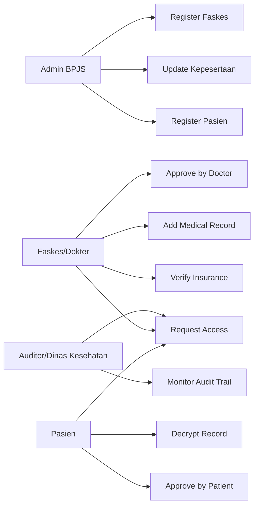

# Laporan Teknis dan Implementation Plan

## Instruksi Penerapan Blockchain untuk BPJS: Rekam Medis dan Kepesertaan

**Versi:** 1.0
**Format:** Markdown
**Bahasa:** Indonesia formal akademik
**Scope:** Dokumentasi teknis akademik dan implementation plan. Tidak mencakup implementasi kode final, gas report terperinci, atau video demo script.
**Studi kasus:** Sistem Rekam Medis Terintegrasi dan Kepesertaan BPJS berbasis blockchain privat.

---

## 1. Ringkasan Eksekutif

Dokumen ini menjelaskan rancangan dan rencana implementasi DApp untuk studi kasus **BPJS Rekam Medis dan Kepesertaan** menggunakan jaringan blockchain privat berbasis **Hyperledger Besu Ethereum-compatible network**. Sistem dirancang untuk menyelesaikan dua masalah utama pada sektor kesehatan publik:

1. **Integritas rekam medis**
   Setiap riwayat kunjungan, diagnosis, tindakan, dan obat dicatat sebagai transaksi permanen. Data yang telah dicatat tidak dapat dihapus atau dimanipulasi secara sepihak.

2. **Portabilitas dan kontrol akses data pasien**
   Rekam medis dapat diakses lintas fasilitas kesehatan dengan mekanisme persetujuan digital ganda dari pasien dan dokter/faskes. Data sensitif tidak disimpan langsung di blockchain, melainkan dienkripsi di frontend dan disimpan di IPFS lokal.

Sistem ini tidak menggunakan backend aplikasi. Semua interaksi dilakukan langsung dari frontend React + Vite ke:

- MetaMask
- RPC Besu
- Smart contract
- IPFS Kubo lokal
- Blockscout sebagai explorer

---

## 2. Dasar Penugasan

Tugas besar mensyaratkan DApp berbasis blockchain untuk sektor publik, dengan komponen utama berupa smart contract, frontend Web3, IPFS, laporan teknis, dan simulasi node antar laptop. Untuk topik BPJS, fokus tugas adalah identitas pasien, portabilitas data, immutability rekam medis, multi-signature approval, dan penyimpanan dokumen besar di IPFS.

Dokumen ini menyesuaikan rancangan dengan kondisi existing:

| Komponen              | Kondisi                                                 |
| --------------------- | ------------------------------------------------------- |
| Blockchain client     | Hyperledger Besu                                        |
| Jenis jaringan        | Custom private Ethereum-compatible network              |
| Consensus             | QBFT                                                |
| Chain ID              | 1337                                                    |
| RPC                   | `http://45.126.40.107:8545`                             |
| Jumlah node           | 5 node                                                  |
| Runtime node          | Docker Compose                                          |
| Explorer              | Blockscout                                              |
| Gas policy            | Zero gas / transaksi tidak dikenakan biaya native token |
| Backend aplikasi      | Tidak digunakan                                         |
| Frontend              | React + Vite                                            |
| Contract tooling      | Hardhat                                                 |
| Decentralized storage | IPFS lokal via Kubo                                     |

---

## 3. Tujuan Sistem

### 3.1 Tujuan Akademik

Sistem ini dirancang untuk memenuhi capaian tugas besar, yaitu merancang DApp yang menunjukkan:

- penerapan smart contract untuk proses sektor publik;
- integrasi frontend Web3 dengan MetaMask;
- pemanfaatan IPFS untuk file besar;
- penerapan access control;
- penerapan pola keamanan Checks-Effects-Interactions;
- pencatatan transaksi pada jaringan node lokal/privat;
- transparansi transaksi melalui explorer.

### 3.2 Tujuan Fungsional

Sistem harus mampu:

1. Mendaftarkan pasien BPJS dengan identitas digital berbasis hash nomor BPJS.
2. Mendaftarkan akun faskes/dokter.
3. Mendaftarkan akun auditor/Dinas Kesehatan.
4. Memverifikasi status kepesertaan BPJS pasien.
5. Mencatat rekam medis baru oleh faskes/dokter yang berwenang.
6. Menyimpan dokumen medis terenkripsi di IPFS lokal.
7. Menyimpan hash/CID IPFS dan metadata minimal di blockchain.
8. Mengelola permintaan akses rekam medis.
9. Mewajibkan approval pasien dan dokter/faskes sebelum data dapat didekripsi.
10. Menyediakan dashboard frontend minimal untuk seluruh role.

---

## 4. Scope dan Non-Scope

### 4.1 Scope Utama

Dokumen ini mencakup:

- arsitektur jaringan;
- arsitektur aplikasi;
- desain smart contract;
- state schema smart contract;
- model identitas pasien;
- model enkripsi frontend;
- model integrasi IPFS Kubo;
- desain frontend;
- desain access control;
- sequence flow;
- rencana implementasi bertahap;
- skenario pengujian;
- risiko dan mitigasi;
- acceptance criteria.

### 4.2 Non-Scope

Hal berikut tidak menjadi deliverable utama dalam dokumen ini:

- implementasi kode final;
- gas report terperinci;
- video demo script;
- backend API;
- database off-chain;
- integrasi langsung ke sistem BPJS nyata;
- integrasi ke rekam medis elektronik rumah sakit nyata;
- penggunaan data pasien asli.

### 4.3 Catatan tentang Zero Gas

Walaupun jaringan dikonfigurasi sebagai **zero gas**, EVM tetap menghitung `gasUsed` sebagai satuan komputasi. Perbedaannya adalah `gasPrice` dapat diatur menjadi `0`, sehingga transaksi tidak mengurangi saldo native token. Dengan demikian, pada tugas ini `gasUsed` dapat diperlakukan sebagai metrik teknis opsional, bukan biaya transaksi.

---

## 5. Prinsip Desain

Sistem dirancang dengan prinsip berikut.

### 5.1 Minimal

Rancangan hanya memuat komponen yang diperlukan untuk memenuhi tugas:

- satu frontend;
- smart contract modular;
- IPFS lokal;
- MetaMask;
- Blockscout;
- tanpa backend aplikasi.

### 5.2 Privacy by Design

Data pribadi dan data medis tidak disimpan plaintext di blockchain. Blockchain hanya menyimpan:

- hash identitas pasien;
- status kepesertaan;
- kelas layanan;
- metadata rekam medis;
- CID/hash IPFS dari payload terenkripsi;
- status approval akses.

### 5.3 Immutability

Rekam medis tidak dihapus dan tidak diedit. Jika ada koreksi, sistem membuat record baru yang merujuk record sebelumnya.

### 5.4 Role-Based Access Control

Fungsi sensitif hanya dapat dipanggil oleh role tertentu:

- `AdminBPJS`;
- `Faskes/Dokter`;
- `Pasien`;
- `Auditor/DinasKesehatan`.

### 5.5 Consent-Based Access

Akses rekam medis memerlukan approval dari:

1. pasien; dan
2. dokter/faskes penerbit record.

### 5.6 No Backend

Frontend berkomunikasi langsung ke smart contract dan IPFS Kubo lokal. Tidak ada server aplikasi yang menyimpan session, database, atau dokumen medis.

---

## 6. Arsitektur Jaringan

### 6.1 Topologi Node

Jaringan terdiri dari 5 node Besu berbasis QBFT.

| Node     | Peran Simulasi       | Fungsi                                  |
| -------- | -------------------- | --------------------------------------- |
| Laptop 1 | BPJS Kantor Cabang 1 | Validator utama dan AdminBPJS           |
| Laptop 2 | BPJS Kantor Cabang 2 | Validator cadangan dan AdminBPJS backup |
| Laptop 3 | Rumah Sakit A        | Faskes/Dokter                           |
| Laptop 4 | Rumah Sakit B        | Faskes/Dokter                           |
| Laptop 5 | Dinas Kesehatan      | Auditor/Monitoring                      |

### 6.2 Karakteristik Jaringan

| Aspek           | Nilai                                       |
| --------------- | ------------------------------------------- |
| Network type    | Private permissioned EVM-compatible network |
| Client          | Hyperledger Besu                            |
| Consensus       | QBFT                                    |
| Validator model | Known validator / Proof of Authority style  |
| Chain ID        | 1337                                        |
| RPC endpoint    | `http://45.126.40.107:8545`                 |
| Explorer        | Blockscout                                  |
| Deployment      | Docker Compose                              |
| Biaya transaksi | Zero gas                                    |

### 6.3 Diagram Arsitektur Jaringan



---

## 7. Arsitektur Aplikasi

### 7.1 Komponen Aplikasi

| Komponen        | Teknologi     | Fungsi                                         |
| --------------- | ------------- | ---------------------------------------------- |
| Frontend        | React + Vite  | Dashboard pengguna                             |
| Wallet          | MetaMask      | Signing transaksi dan autentikasi wallet       |
| Smart contract  | Solidity      | Registry, kepesertaan, rekam medis, akses data |
| Deployment tool | Hardhat       | Compile, test, deploy ke Besu                  |
| Blockchain      | Besu QBFT | Ledger privat dan finality transaksi           |
| Storage         | IPFS Kubo     | Menyimpan payload medis terenkripsi            |
| Explorer        | Blockscout    | Monitoring transaksi dan contract              |

### 7.2 Alur Komunikasi



### 7.3 Tidak Ada Backend

Karena sistem tidak menggunakan backend, maka:

- ABI contract disimpan di frontend;
- alamat contract disimpan di konfigurasi frontend;
- upload IPFS dilakukan dari browser ke Kubo API lokal;
- enkripsi dan dekripsi dilakukan di browser;
- akses data dikontrol oleh smart contract;
- audit dilakukan melalui event contract dan Blockscout.

---

## 8. Role dan Hak Akses

### 8.1 Daftar Role

| Role                     | Aktor              | Hak Akses                                                                         |
| ------------------------ | ------------------ | --------------------------------------------------------------------------------- |
| `AdminBPJS`              | BPJS Kantor Cabang | Registrasi pasien, faskes, auditor, update status kepesertaan                     |
| `Faskes/Dokter`          | RS/Klinik/Dokter   | Verifikasi kepesertaan, tambah rekam medis, approve akses record yang diterbitkan |
| `Pasien`                 | Peserta BPJS       | Melihat status kepesertaan, melihat daftar record, approve akses data             |
| `Auditor/DinasKesehatan` | Dinas Kesehatan    | Melihat metadata dan audit trail tanpa data medis plaintext                       |

### 8.2 Matrix Hak Akses

| Fungsi                      |           AdminBPJS |  Faskes/Dokter |            Pasien |        Auditor |
| --------------------------- | ------------------: | -------------: | ----------------: | -------------: |
| Register pasien             |                  Ya |          Tidak |             Tidak |          Tidak |
| Update status kepesertaan   |                  Ya |          Tidak |             Tidak |          Tidak |
| Register faskes             |                  Ya |          Tidak |             Tidak |          Tidak |
| Register auditor            |                  Ya |          Tidak |             Tidak |          Tidak |
| Verify insurance            |                  Ya |             Ya | Ya, milik sendiri |  Ya, read-only |
| Add medical record          |               Tidak |             Ya |             Tidak |          Tidak |
| Request access              | Ya, jika diperlukan |             Ya |                Ya |             Ya |
| Approve by patient          |               Tidak |          Tidak |                Ya |          Tidak |
| Approve by doctor/faskes    |               Tidak |             Ya |             Tidak |          Tidak |
| Submit encrypted access key |               Tidak |    Ya / Pasien |       Ya / Faskes |          Tidak |
| Read decrypted record       |      Jika disetujui | Jika disetujui |     Milik sendiri | Jika disetujui |
| Read audit metadata         |                  Ya |       Terbatas |          Terbatas |             Ya |

---

## 9. Model Identitas Pasien

### 9.1 DID Pasien

Nomor BPJS menjadi basis identitas, tetapi tidak disimpan plaintext di blockchain.

Format konseptual:

```text
did:bpjs:1337:<patientIdHash>
```

`patientIdHash` dihitung di frontend:

```text
patientIdHash = keccak256(nomorBPJS + institutionSalt)
```

Catatan:

- `nomorBPJS` tidak pernah dikirim sebagai plaintext ke blockchain.
- `institutionSalt` digunakan untuk mengurangi risiko identifikasi langsung.
- Untuk demo akademik, salt dapat berada di konfigurasi frontend.
- Untuk produksi, salt dan proses identity proofing harus dikelola oleh sistem institusional yang lebih aman.

### 9.2 Identitas Wallet

Setiap pasien juga memiliki address wallet:

```text
patientWallet = 0x...
```

Mapping identitas:

```text
patientIdHash -> patientWallet
patientWallet -> patientIdHash
```

Dengan desain ini, pasien dapat membuktikan kepemilikan identitas melalui tanda tangan MetaMask.

---

## 10. Model Data Rekam Medis

### 10.1 Prinsip Penyimpanan

| Jenis Data                   | Lokasi          | Format                             |
| ---------------------------- | --------------- | ---------------------------------- |
| Nomor BPJS asli              | Tidak disimpan  | Hanya input sementara di frontend  |
| Hash nomor BPJS              | Blockchain      | `bytes32`                          |
| Status kepesertaan           | Blockchain      | `bool`                             |
| Kelas layanan                | Blockchain      | `uint8`                            |
| Diagnosis                    | IPFS            | JSON terenkripsi                   |
| Tindakan medis               | IPFS            | JSON terenkripsi                   |
| Obat                         | IPFS            | JSON terenkripsi                   |
| Dokumen scan/lab             | IPFS            | File terenkripsi                   |
| CID IPFS payload terenkripsi | Blockchain      | `string` atau `bytes`              |
| Hash payload terenkripsi     | Blockchain      | `bytes32`                          |
| Approval akses               | Blockchain      | Struct/mapping                     |
| Kunci dekripsi               | Tidak plaintext | Encrypted key untuk penerima akses |

### 10.2 Payload Medis di IPFS

Contoh struktur JSON sebelum dienkripsi:

```json
{
  "schemaVersion": "1.0",
  "patientIdHash": "0x...",
  "facilityId": "RS-A",
  "doctorWallet": "0x...",
  "visitDate": "2026-05-10",
  "diagnosis": "Contoh diagnosis demo",
  "treatment": "Contoh tindakan demo",
  "medicines": ["Obat A", "Obat B"],
  "attachments": [
    {
      "fileName": "hasil-lab.pdf",
      "mimeType": "application/pdf",
      "sha256": "..."
    }
  ]
}
```

Payload di atas dienkripsi di frontend sebelum diunggah ke IPFS.

---

## 11. Desain Smart Contract

### 11.1 Kontrak yang Disarankan

Agar tetap bersih dan minimal, gunakan 3 kontrak:

1. `BPJSRegistry.sol`
   Mengelola pasien, faskes, auditor, status kepesertaan, dan kelas layanan.

2. `MedicalRecord.sol`
   Mengelola metadata rekam medis, CID IPFS terenkripsi, dan event audit.

3. `AccessManager.sol`
   Mengelola request akses, approval pasien, approval dokter/faskes, dan encrypted access key.

Alternatif paling minimal adalah menggabungkan seluruh fungsi ke satu kontrak `BPJSMedicalRecord.sol`, tetapi desain 3 kontrak lebih mudah diuji dan lebih rapi untuk laporan akademik.

### 11.2 Role Contract

Role menggunakan pola RBAC:

```solidity
bytes32 public constant ADMIN_BPJS_ROLE = keccak256("ADMIN_BPJS_ROLE");
bytes32 public constant FASKES_ROLE = keccak256("FASKES_ROLE");
bytes32 public constant AUDITOR_ROLE = keccak256("AUDITOR_ROLE");
```

Pasien tidak harus menggunakan role global. Pasien diidentifikasi melalui mapping `patientWallet`.

### 11.3 State Schema: BPJSRegistry

| Field                  | Type                          | Deskripsi                               |
| ---------------------- | ----------------------------- | --------------------------------------- |
| `patients`             | `mapping(bytes32 => Patient)` | Data pasien berdasarkan `patientIdHash` |
| `patientOfWallet`      | `mapping(address => bytes32)` | Mapping wallet ke patient hash          |
| `faskes`               | `mapping(address => Faskes)`  | Data faskes/dokter                      |
| `auditors`             | `mapping(address => bool)`    | Status auditor                          |
| `encryptionPublicKeys` | `mapping(address => bytes)`   | Public key enkripsi pengguna            |

Struct:

```solidity
struct Patient {
    bytes32 patientIdHash;
    address wallet;
    bool active;
    uint8 serviceClass;
    uint64 registeredAt;
    uint64 updatedAt;
}

struct Faskes {
    address wallet;
    bytes32 facilityIdHash;
    bool active;
    uint64 registeredAt;
}
```

### 11.4 State Schema: MedicalRecord

| Field            | Type                            | Deskripsi                |
| ---------------- | ------------------------------- | ------------------------ |
| `records`        | `mapping(uint256 => Record)`    | Rekam medis              |
| `patientRecords` | `mapping(bytes32 => uint256[])` | Daftar record per pasien |
| `recordCounter`  | `uint256`                       | Counter record ID        |

Struct:

```solidity
struct Record {
    uint256 recordId;
    bytes32 patientIdHash;
    address issuerFaskes;
    address doctorWallet;
    string encryptedPayloadCid;
    bytes32 encryptedPayloadHash;
    bytes32 recordTypeHash;
    uint64 createdAt;
    bool active;
}
```

Catatan:

- `encryptedPayloadCid` adalah CID dari payload yang sudah terenkripsi.
- Jika ingin lebih ketat, CID dapat disimpan dalam bentuk encrypted string.
- `encryptedPayloadHash` digunakan untuk validasi integritas tambahan.

### 11.5 State Schema: AccessManager

| Field                 | Type                                | Deskripsi                     |
| --------------------- | ----------------------------------- | ----------------------------- |
| `accessRequests`      | `mapping(uint256 => AccessRequest)` | Data permintaan akses         |
| `accessCounter`       | `uint256`                           | Counter request ID            |
| `encryptedAccessKeys` | `mapping(uint256 => bytes)`         | Encrypted DEK untuk requester |

Struct:

```solidity
enum AccessStatus {
    Pending,
    PatientApproved,
    DoctorApproved,
    Granted,
    Rejected,
    Revoked,
    Expired
}

struct AccessRequest {
    uint256 requestId;
    uint256 recordId;
    address requester;
    address patientWallet;
    address issuerFaskes;
    bool patientApproved;
    bool doctorApproved;
    uint64 requestedAt;
    uint64 expiresAt;
    AccessStatus status;
}
```

### 11.6 Fungsi Utama

#### BPJSRegistry

```solidity
function registerPatient(
    bytes32 patientIdHash,
    address patientWallet,
    uint8 serviceClass,
    bytes calldata encryptionPublicKey
) external onlyRole(ADMIN_BPJS_ROLE);

function updateInsuranceStatus(
    bytes32 patientIdHash,
    bool active,
    uint8 serviceClass
) external onlyRole(ADMIN_BPJS_ROLE);

function registerFaskes(
    address faskesWallet,
    bytes32 facilityIdHash,
    bytes calldata encryptionPublicKey
) external onlyRole(ADMIN_BPJS_ROLE);

function registerAuditor(
    address auditorWallet,
    bytes calldata encryptionPublicKey
) external onlyRole(ADMIN_BPJS_ROLE);

function verifyInsurance(
    bytes32 patientIdHash
) external view returns (bool active, uint8 serviceClass);
```

#### MedicalRecord

```solidity
function addRecord(
    bytes32 patientIdHash,
    address doctorWallet,
    string calldata encryptedPayloadCid,
    bytes32 encryptedPayloadHash,
    bytes32 recordTypeHash
) external onlyRole(FASKES_ROLE) returns (uint256 recordId);

function getPatientRecords(
    bytes32 patientIdHash
) external view returns (uint256[] memory);

function getRecordMetadata(
    uint256 recordId
) external view returns (Record memory);
```

#### AccessManager

```solidity
function requestAccess(
    uint256 recordId,
    uint64 expiresAt
) external returns (uint256 requestId);

function approveByPatient(
    uint256 requestId
) external;

function approveByDoctor(
    uint256 requestId
) external;

function submitAccessKey(
    uint256 requestId,
    bytes calldata encryptedDekForRequester
) external;

function revokeAccess(
    uint256 requestId
) external;

function getAccessStatus(
    uint256 requestId
) external view returns (AccessStatus);
```

### 11.7 Event Audit

```solidity
event PatientRegistered(bytes32 indexed patientIdHash, address indexed wallet);
event InsuranceUpdated(bytes32 indexed patientIdHash, bool active, uint8 serviceClass);
event FaskesRegistered(address indexed faskesWallet, bytes32 indexed facilityIdHash);
event AuditorRegistered(address indexed auditorWallet);

event RecordAdded(
    uint256 indexed recordId,
    bytes32 indexed patientIdHash,
    address indexed issuerFaskes,
    string encryptedPayloadCid
);

event AccessRequested(
    uint256 indexed requestId,
    uint256 indexed recordId,
    address indexed requester
);

event PatientApproved(uint256 indexed requestId, address indexed patient);
event DoctorApproved(uint256 indexed requestId, address indexed doctor);
event AccessGranted(uint256 indexed requestId, address indexed requester);
event AccessRevoked(uint256 indexed requestId);
```

---

## 12. Pola Keamanan Smart Contract

### 12.1 Access Control

Semua fungsi administratif harus menggunakan modifier role.

Contoh aturan:

- hanya `AdminBPJS` yang boleh mendaftarkan pasien;
- hanya `AdminBPJS` yang boleh mengubah status kepesertaan;
- hanya `Faskes/Dokter` yang boleh memanggil `addRecord`;
- hanya pasien terkait yang boleh memanggil `approveByPatient`;
- hanya faskes penerbit record yang boleh memanggil `approveByDoctor`;
- auditor hanya read-only.

### 12.2 Checks-Effects-Interactions

Pola CEI diterapkan dengan urutan:

1. **Checks**
   Validasi role, status pasien, status record, dan status request.

2. **Effects**
   Update state contract.

3. **Interactions**
   Emit event atau interaksi eksternal jika ada.

Karena desain ini tidak memerlukan transfer Ether atau pemanggilan kontrak eksternal yang kompleks, risiko reentrancy rendah. Namun, pola CEI tetap digunakan sebagai standar keamanan.

### 12.3 Validasi Input

Validasi minimal:

- `patientIdHash != bytes32(0)`;
- `patientWallet != address(0)`;
- `serviceClass` hanya `1`, `2`, atau `3`;
- `encryptedPayloadCid` tidak kosong;
- `encryptedPayloadHash != bytes32(0)`;
- `expiresAt > block.timestamp`;
- request belum expired;
- approval belum dilakukan sebelumnya.

### 12.4 Privasi On-Chain

Tidak boleh menyimpan:

- nama pasien;
- nomor BPJS plaintext;
- NIK;
- alamat;
- tanggal lahir;
- diagnosis plaintext;
- tindakan plaintext;
- obat plaintext;
- file medis plaintext;
- kunci dekripsi plaintext.

---

## 13. Desain Enkripsi Frontend

### 13.1 Tujuan

Enkripsi dilakukan agar payload rekam medis tetap rahasia walaupun CID IPFS diketahui oleh pihak lain.

### 13.2 Key Model

Gunakan dua jenis kunci:

1. **DEK - Data Encryption Key**
   Kunci simetris acak per record medis. Digunakan untuk mengenkripsi payload medis dengan AES-GCM.

2. **User Encryption Key Pair**
   Kunci publik/privat tiap user untuk membungkus DEK. Public key diregistrasikan ke blockchain. Private key disimpan lokal di browser pengguna.

### 13.3 Proses Registrasi Public Key

1. User membuka frontend.
2. Frontend membuat key pair enkripsi.
3. Public key dikirim ke smart contract saat registrasi user.
4. Private key disimpan lokal pada browser dan dienkripsi dengan passphrase pengguna.

Catatan keamanan:

- Penyimpanan private key di browser cukup untuk demo akademik.
- Untuk produksi, private key sebaiknya disimpan pada secure enclave, wallet khusus, atau key management system institusional.

### 13.4 Proses Tambah Rekam Medis



### 13.5 Proses Permintaan Akses



### 13.6 Status Akses

| Status            | Makna                                             |
| ----------------- | ------------------------------------------------- |
| `Pending`         | Request dibuat tetapi belum disetujui             |
| `PatientApproved` | Pasien sudah approve                              |
| `DoctorApproved`  | Dokter/faskes sudah approve                       |
| `Granted`         | Kedua approval lengkap dan encrypted key tersedia |
| `Rejected`        | Request ditolak                                   |
| `Revoked`         | Akses dicabut                                     |
| `Expired`         | Waktu akses habis                                 |

---

## 14. Integrasi IPFS Kubo Lokal

### 14.1 Peran IPFS

IPFS digunakan untuk menyimpan payload rekam medis terenkripsi, seperti:

- hasil laboratorium;
- hasil radiologi;
- catatan pemeriksaan;
- dokumen scan;
- metadata medis detail.

Blockchain hanya menyimpan CID/hash dan metadata minimal.

### 14.2 Mode Deployment IPFS

Untuk deployment repository ini, IPFS Kubo dijalankan hanya pada host `node1`, yaitu host yang juga menjalankan Blockscout. Frontend mengunggah payload terenkripsi ke Kubo API pada host `node1`, lalu menyimpan CID ke smart contract. Peserta lain membaca payload melalui gateway Kubo pada host `node1` sesuai endpoint yang dikonfigurasi.

Model ini dipilih agar demo tetap sederhana dan konsisten dengan topologi operasional existing:

- satu Kubo node aktif di host `node1`;
- frontend mengunggah file ke Kubo API milik host `node1`;
- CID disimpan ke blockchain;
- peserta lain mengambil file melalui gateway Kubo milik host `node1`.

### 14.3 Endpoint IPFS

Konfigurasi default:

```text
Kubo API lokal:       http://127.0.0.1:5001
Kubo API jaringan:    http://<ip-host-node1>:5001
Kubo Gateway lokal:   http://127.0.0.1:8080
Kubo Gateway jaringan: http://<ip-host-node1>:8080
```

Pada mode distributed, endpoint tersebut berada di host `node1`. Port API dan gateway dipublish pada `0.0.0.0` di host Docker, sehingga frontend dari perangkat lain dapat menggunakan IP LAN atau WireGuard host `node1`.

Frontend environment:

```text
VITE_IPFS_API_URL=http://127.0.0.1:5001
VITE_IPFS_GATEWAY_URL=http://127.0.0.1:8080
```

### 14.4 CORS untuk Frontend

Karena frontend Vite biasanya berjalan di `http://localhost:5173`, Kubo API perlu mengizinkan origin tersebut.

Contoh konfigurasi:

```bash
ipfs config --json API.HTTPHeaders.Access-Control-Allow-Origin '["http://localhost:5173"]'
ipfs config --json API.HTTPHeaders.Access-Control-Allow-Methods '["PUT", "POST", "GET"]'
ipfs config --json API.HTTPHeaders.Access-Control-Allow-Headers '["Authorization", "Content-Type"]'
```

---

## 15. Desain Frontend

### 15.1 Stack

| Komponen           | Pilihan                               |
| ------------------ | ------------------------------------- |
| Framework          | React                                 |
| Build tool         | Vite                                  |
| Wallet integration | MetaMask                              |
| Web3 library       | ethers.js atau viem                   |
| Crypto             | Web Crypto API + library key exchange |
| Storage            | IPFS Kubo HTTP API                    |
| Styling            | CSS sederhana / Tailwind optional     |

### 15.2 Halaman Frontend

#### 1. Connect Wallet

Fungsi:

- connect MetaMask;
- cek `chainId == 1337`;
- tampilkan address;
- tampilkan role user;
- tombol tambah custom network jika belum sesuai.

#### 2. Dashboard Admin BPJS

Fungsi:

- register pasien;
- update status aktif/tidak aktif;
- set kelas layanan;
- register faskes/dokter;
- register auditor;
- lihat event administrasi.

#### 3. Dashboard Pasien

Fungsi:

- lihat status kepesertaan;
- lihat kelas layanan;
- lihat daftar record;
- lihat request akses masuk;
- approve/reject request akses;
- decrypt record yang diizinkan;
- revoke akses jika diperlukan.

#### 4. Dashboard Faskes/Dokter

Fungsi:

- cek kepesertaan pasien;
- tambah rekam medis;
- upload payload terenkripsi ke IPFS;
- approve akses record yang diterbitkan;
- submit encrypted DEK untuk requester.

#### 5. Dashboard Auditor/Dinas Kesehatan

Fungsi:

- lihat metadata record;
- lihat event `RecordAdded`;
- lihat log akses;
- tidak dapat melihat data medis plaintext tanpa approval.

### 15.3 Struktur Komponen Frontend

```text
frontend/
  src/
    abi/
      BPJSRegistry.json
      MedicalRecord.json
      AccessManager.json
    components/
      ConnectWallet.jsx
      RoleGate.jsx
      RecordCard.jsx
      AccessRequestCard.jsx
    pages/
      AdminDashboard.jsx
      PatientDashboard.jsx
      FaskesDashboard.jsx
      AuditorDashboard.jsx
    services/
      blockchain.js
      ipfs.js
      crypto.js
      identity.js
    config/
      contracts.js
      network.js
    App.jsx
    main.jsx
```

---

## 16. Konfigurasi MetaMask

Tambahkan custom network:

| Field              | Nilai                       |
| ------------------ | --------------------------- |
| Network name       | BPJS Besu Private Network   |
| RPC URL            | `http://45.126.40.107:8545` |
| Chain ID           | `1337`                      |
| Currency symbol    | `ETH` atau `BESU`           |
| Block explorer URL | `<BLOCKSCOUT_URL>`          |

Catatan:

- Chain ID 1337 dalam hex adalah `0x539`.
- Karena jaringan zero gas, transaksi tidak memerlukan biaya native token, tetapi tetap memerlukan gas limit.
- Pastikan RPC dapat diakses dari browser dan MetaMask.

---

## 17. Konfigurasi Hardhat

### 17.1 Environment

```text
BESU_RPC_URL=http://45.126.40.107:8545
DEPLOYER_PRIVATE_KEY=<private_key_admin_bpjs>
CHAIN_ID=1337
```

### 17.2 Network Config Konseptual

```javascript
networks: {
  besu: {
    url: process.env.BESU_RPC_URL,
    chainId: 1337,
    gasPrice: 0,
    accounts: [process.env.DEPLOYER_PRIVATE_KEY]
  }
}
```

### 17.3 Deployment Flow

1. Compile contract.
2. Jalankan unit test lokal.
3. Deploy `BPJSRegistry`.
4. Deploy `MedicalRecord` dengan alamat registry.
5. Deploy `AccessManager` dengan alamat registry dan medical record.
6. Grant role:
   - AdminBPJS;
   - Faskes/Dokter;
   - Auditor.
7. Simpan contract address ke frontend.
8. Verifikasi transaksi deploy di Blockscout.

---

## 18. Struktur Repository

```text
bpjs-blockchain-dapp/
  README.md
  docs/
    laporan-teknis.md
    architecture.md
    implementation-plan.md
    testing-plan.md
  contracts/
    BPJSRegistry.sol
    MedicalRecord.sol
    AccessManager.sol
  scripts/
    deploy.js
    setup-roles.js
    seed-demo-data.js
  test/
    BPJSRegistry.test.js
    MedicalRecord.test.js
    AccessManager.test.js
  frontend/
    index.html
    package.json
    vite.config.js
    src/
      abi/
      components/
      pages/
      services/
      config/
  hardhat.config.js
  package.json
  .env.example
```

---

## 19. Use Case Diagram



---

## 20. Alur Bisnis Utama

### 20.1 Registrasi Pasien

1. Admin BPJS membuka dashboard.
2. Admin memasukkan nomor BPJS pasien dan wallet pasien.
3. Frontend menghitung `patientIdHash`.
4. Frontend membuat atau menerima public key enkripsi pasien.
5. Admin memanggil `registerPatient`.
6. Contract menyimpan status aktif dan kelas layanan.
7. Event `PatientRegistered` tercatat di blockchain.

### 20.2 Verifikasi Kepesertaan

1. Faskes memasukkan nomor BPJS atau `patientIdHash`.
2. Frontend memanggil `verifyInsurance`.
3. Contract mengembalikan:
   - `active`;
   - `serviceClass`.
4. Jika aktif, faskes dapat melanjutkan pencatatan rekam medis.
5. Jika tidak aktif, transaksi `addRecord` dapat ditolak atau diberi status administratif tertentu.

### 20.3 Tambah Rekam Medis

1. Faskes mengisi data pemeriksaan.
2. Frontend memverifikasi status kepesertaan.
3. Frontend membuat payload JSON.
4. Frontend mengenkripsi payload dengan DEK.
5. Frontend upload ciphertext ke IPFS Kubo.
6. IPFS mengembalikan CID.
7. Frontend menghitung hash ciphertext.
8. Faskes memanggil `addRecord`.
9. Contract menyimpan metadata record dan emit event.

### 20.4 Permintaan Akses Data

1. Requester memilih record.
2. Requester memanggil `requestAccess`.
3. Pasien melihat request dan memanggil `approveByPatient`.
4. Dokter/faskes penerbit record memanggil `approveByDoctor`.
5. Setelah kedua approval lengkap, pasien/faskes membungkus DEK untuk requester.
6. Encrypted DEK disimpan dengan `submitAccessKey`.
7. Requester dapat fetch ciphertext dari IPFS dan decrypt di frontend.

### 20.5 Audit

1. Auditor membuka dashboard.
2. Frontend membaca event dan metadata record.
3. Auditor melihat:
   - jumlah record;
   - timestamp;
   - faskes penerbit;
   - status akses;
   - hash/CID;
   - tanpa diagnosis plaintext.
4. Jika auditor perlu akses isi record, auditor tetap harus membuat request dan memperoleh approval.

---

## 21. Implementation Plan

### 21.1 Milestone 0 - Finalisasi Scope

**Tujuan:** menyepakati scope minimal agar implementasi tidak melebar.

Output:

- daftar role final;
- daftar fungsi final;
- daftar halaman frontend final;
- daftar akun wallet demo;
- URL Blockscout final.

Acceptance criteria:

- semua anggota memahami role masing-masing;
- node Besu dan Blockscout sudah bisa diakses;
- MetaMask bisa connect ke chain ID 1337.

---

### 21.2 Milestone 1 - Setup Repository

**Tugas:**

1. Buat repo `bpjs-blockchain-dapp`.
2. Inisialisasi Hardhat.
3. Inisialisasi frontend React + Vite.
4. Buat folder `docs`, `contracts`, `scripts`, `test`, `frontend`.
5. Buat `.env.example`.

Output:

- struktur repo siap;
- project dapat dijalankan lokal;
- README awal tersedia.

Acceptance criteria:

- `npm install` berhasil;
- `npx hardhat compile` dapat dijalankan setelah contract placeholder dibuat;
- `npm run dev` pada frontend berjalan.

---

### 21.3 Milestone 2 - Smart Contract Registry

**Tugas:**

1. Implementasi `BPJSRegistry.sol`.
2. Tambahkan role:
   - AdminBPJS;
   - Faskes;
   - Auditor.
3. Tambahkan fungsi:
   - `registerPatient`;
   - `updateInsuranceStatus`;
   - `registerFaskes`;
   - `registerAuditor`;
   - `verifyInsurance`;
   - `registerEncryptionPublicKey`.

Output:

- contract registry;
- unit test registry.

Acceptance criteria:

- hanya admin yang bisa register pasien;
- hanya admin yang bisa update kepesertaan;
- service class hanya menerima nilai 1, 2, atau 3;
- `verifyInsurance` mengembalikan status benar.

---

### 21.4 Milestone 3 - Smart Contract Medical Record

**Tugas:**

1. Implementasi `MedicalRecord.sol`.
2. Tambahkan fungsi:
   - `addRecord`;
   - `getPatientRecords`;
   - `getRecordMetadata`.
3. Hubungkan contract ke `BPJSRegistry`.
4. Tambahkan validasi role faskes.
5. Tambahkan validasi pasien aktif.

Output:

- contract rekam medis;
- unit test rekam medis.

Acceptance criteria:

- akun tanpa role faskes gagal memanggil `addRecord`;
- record hanya dapat ditambahkan untuk pasien terdaftar;
- metadata record tersimpan;
- event `RecordAdded` muncul.

---

### 21.5 Milestone 4 - Smart Contract Access Manager

**Tugas:**

1. Implementasi `AccessManager.sol`.
2. Tambahkan fungsi:
   - `requestAccess`;
   - `approveByPatient`;
   - `approveByDoctor`;
   - `submitAccessKey`;
   - `revokeAccess`;
   - `getAccessStatus`.
3. Tambahkan validasi requester, pasien, dan faskes penerbit.
4. Tambahkan status akses.

Output:

- contract access manager;
- unit test approval.

Acceptance criteria:

- request tidak langsung granted;
- pasien yang salah tidak bisa approve;
- dokter/faskes yang bukan issuer tidak bisa approve;
- akses hanya `Granted` setelah dua approval dan encrypted key tersedia.

---

### 21.6 Milestone 5 - Deployment ke Besu

**Tugas:**

1. Konfigurasi Hardhat network `besu`.
2. Set `gasPrice: 0`.
3. Deploy contract ke RPC Besu.
4. Simpan alamat contract.
5. Grant role demo:
   - Admin BPJS;
   - RS A;
   - RS B;
   - Auditor Dinkes.
6. Cek transaksi di Blockscout.

Output:

- contract address;
- deployment log;
- setup role lengkap.

Acceptance criteria:

- semua contract terdeploy di chain ID 1337;
- transaksi deploy terlihat di Blockscout;
- akun demo memiliki role sesuai peran.

---

### 21.7 Milestone 6 - Integrasi Frontend Web3

**Tugas:**

1. Implementasi connect wallet.
2. Deteksi chain ID.
3. Tampilkan address dan role.
4. Load ABI dan contract address.
5. Buat service `blockchain.js`.

Output:

- frontend dapat membaca smart contract;
- user dapat mengirim transaksi.

Acceptance criteria:

- MetaMask connect ke chain ID 1337;
- role user tampil;
- transaksi sederhana berhasil dari frontend.

---

### 21.8 Milestone 7 - Integrasi IPFS Kubo

**Tugas:**

1. Jalankan Kubo lokal.
2. Konfigurasi CORS.
3. Buat service `ipfs.js`.
4. Implementasi upload ciphertext.
5. Implementasi fetch ciphertext dari CID.
6. Validasi hash payload.

Output:

- frontend dapat upload file terenkripsi ke IPFS;
- CID dapat disimpan ke blockchain.

Acceptance criteria:

- file berhasil diupload ke Kubo;
- CID dapat diakses melalui gateway lokal;
- hash ciphertext cocok dengan hash on-chain.

---

### 21.9 Milestone 8 - Modul Enkripsi Frontend

**Tugas:**

1. Implementasi generate key pair user.
2. Simpan private key lokal terenkripsi passphrase.
3. Register public key ke smart contract.
4. Implementasi AES-GCM encrypt/decrypt payload.
5. Implementasi encrypt DEK untuk patient/faskes/requester.
6. Implementasi decrypt DEK.

Output:

- service `crypto.js`;
- data medis tidak pernah plaintext di IPFS;
- requester hanya bisa decrypt setelah approval.

Acceptance criteria:

- ciphertext tidak dapat dibaca langsung;
- pengguna tanpa encrypted key tidak bisa decrypt;
- setelah approval, requester bisa decrypt payload.

---

### 21.10 Milestone 9 - Dashboard Role

**Tugas:**

1. Buat halaman Admin BPJS.
2. Buat halaman Pasien.
3. Buat halaman Faskes/Dokter.
4. Buat halaman Auditor.
5. Tambahkan `RoleGate`.
6. Tambahkan notifikasi transaksi.

Output:

- semua role memiliki dashboard minimal.

Acceptance criteria:

- Admin dapat register pasien/faskes/auditor;
- Faskes dapat tambah record;
- Pasien dapat approve akses;
- Auditor dapat melihat metadata.

---

### 21.11 Milestone 10 - Testing dan Hardening

**Tugas:**

1. Unit test smart contract.
2. Integration test frontend-contract.
3. Manual test IPFS.
4. Manual test approval flow.
5. Manual test zero gas.
6. Review data privacy.
7. Review access control.

Output:

- hasil pengujian;
- daftar bug dan perbaikan;
- dokumentasi final.

Acceptance criteria:

- semua fungsi utama berhasil;
- tidak ada data medis plaintext di blockchain;
- akses tanpa approval gagal;
- record terlihat immutable;
- transaksi tampil di Blockscout.

---

## 22. Testing Plan

### 22.1 Unit Test Smart Contract

| Test Case                                | Ekspektasi |
| ---------------------------------------- | ---------- |
| Admin register pasien                    | Berhasil   |
| Non-admin register pasien                | Revert     |
| Admin update status                      | Berhasil   |
| Service class invalid                    | Revert     |
| Faskes add record pasien aktif           | Berhasil   |
| Non-faskes add record                    | Revert     |
| Add record pasien tidak aktif            | Revert     |
| Request access record valid              | Berhasil   |
| Approval oleh pasien salah               | Revert     |
| Approval oleh faskes bukan issuer        | Revert     |
| Submit key sebelum dua approval          | Revert     |
| Akses granted setelah dua approval + key | Berhasil   |

### 22.2 Integration Test

| Skenario                               | Ekspektasi   |
| -------------------------------------- | ------------ |
| Connect MetaMask ke chain 1337         | Berhasil     |
| Frontend membaca role user             | Benar        |
| Register pasien dari dashboard admin   | Tx berhasil  |
| Verify insurance dari dashboard faskes | Status benar |
| Upload encrypted payload ke IPFS       | CID diterima |
| Add record menyimpan CID               | Tx berhasil  |
| Record muncul pada dashboard pasien    | Benar        |
| Request akses tampil pada pasien       | Benar        |
| Approval ganda membuat status granted  | Benar        |
| Decrypt payload setelah approval       | Berhasil     |

### 22.3 Security Test

| Area           | Test                                    | Ekspektasi       |
| -------------- | --------------------------------------- | ---------------- |
| Access control | Non-role panggil fungsi admin           | Gagal            |
| Privacy        | Cari diagnosis plaintext di Blockscout  | Tidak ditemukan  |
| Privacy        | Buka CID IPFS tanpa kunci               | Hanya ciphertext |
| Integrity      | Ubah ciphertext lalu validasi hash      | Tidak cocok      |
| Consent        | Requester tanpa approval decrypt record | Gagal            |
| Immutability   | Edit record lama                        | Tidak tersedia   |
| Audit          | Event record dan access muncul          | Tercatat         |

### 22.4 Network Test

| Test                                 | Ekspektasi     |
| ------------------------------------ | -------------- |
| Tx dikirim dari Laptop 3             | Masuk ke block |
| Tx terlihat di Blockscout            | Ya             |
| Laptop 5 membaca event yang sama     | Ya             |
| Node tetap sinkron setelah transaksi | Ya             |
| Transaksi dengan `gasPrice = 0`      | Diterima       |

---

## 23. Acceptance Criteria Final

Sistem dianggap memenuhi scope jika:

1. Jaringan Besu 5 node berjalan dan chain ID 1337 dapat diakses.
2. MetaMask berhasil terhubung ke RPC Besu.
3. Smart contract berhasil dideploy ke Besu.
4. Role AdminBPJS, Faskes/Dokter, Pasien, dan Auditor dapat dibedakan.
5. Admin dapat mendaftarkan pasien.
6. Admin dapat mengatur status aktif dan kelas layanan.
7. Faskes dapat memverifikasi kepesertaan.
8. Faskes dapat menambahkan rekam medis.
9. Payload rekam medis tersimpan terenkripsi di IPFS.
10. Blockchain hanya menyimpan hash/CID dan metadata.
11. Pasien dan dokter/faskes harus approve sebelum data dapat didekripsi.
12. Auditor hanya dapat melihat metadata tanpa data medis plaintext.
13. Semua transaksi utama tampil di Blockscout.
14. Tidak ada backend aplikasi yang digunakan.

---

## 24. Risiko dan Mitigasi

| Risiko                                 | Dampak                           | Mitigasi                                                                           |
| -------------------------------------- | -------------------------------- | ---------------------------------------------------------------------------------- |
| Private key wallet bocor               | Akun dapat disalahgunakan        | Gunakan akun demo, jangan gunakan wallet utama                                     |
| Private encryption key hilang          | Data tidak bisa didekripsi       | Sediakan backup key untuk demo                                                     |
| IPFS node mati                         | File tidak tersedia              | Pin file di lebih dari satu node                                                   |
| CID diketahui pihak lain               | Ciphertext dapat diunduh         | Payload wajib dienkripsi                                                           |
| Salt identitas berada di frontend      | Hash BPJS masih berisiko ditebak | Gunakan data demo; produksi perlu identity service                                 |
| MetaMask menolak zero gas              | Tx gagal                         | Set Besu min gas price 0 dan Hardhat gasPrice 0; fallback gunakan gasPrice minimal |
| CORS Kubo belum dikonfigurasi          | Upload IPFS gagal                | Set CORS Kubo untuk origin Vite                                                    |
| Contract address salah di frontend     | Frontend gagal transaksi         | Simpan address di config dan dokumentasikan deployment                             |
| Data medis plaintext masuk log browser | Kebocoran data                   | Hindari `console.log` payload medis                                                |
| Approval ganda terlalu kompleks        | Demo lambat                      | Gunakan seed data dan akun demo yang jelas                                         |

---

## 25. Data Demo yang Disarankan

Gunakan data dummy.

### 25.1 Akun Demo

| Role             | Nama Demo       | Wallet  |
| ---------------- | --------------- | ------- |
| AdminBPJS        | BPJS Cabang 1   | `0x...` |
| AdminBPJS Backup | BPJS Cabang 2   | `0x...` |
| Faskes           | RS A            | `0x...` |
| Faskes           | RS B            | `0x...` |
| Pasien           | Pasien Demo 1   | `0x...` |
| Auditor          | Dinas Kesehatan | `0x...` |

### 25.2 Pasien Demo

| Field      | Nilai              |
| ---------- | ------------------ |
| Nomor BPJS | `0001234567890`    |
| Status     | Aktif              |
| Kelas      | 1                  |
| Wallet     | Wallet Pasien Demo |

### 25.3 Record Demo

| Field     | Nilai                    |
| --------- | ------------------------ |
| Facility  | RS A                     |
| Diagnosis | Data dummy               |
| Tindakan  | Data dummy               |
| Obat      | Data dummy               |
| File      | PDF dummy atau TXT dummy |
| IPFS      | CID payload terenkripsi  |

---

## 26. Dokumentasi Teknis yang Perlu Disiapkan di Repo

Minimal file dokumentasi:

```text
README.md
docs/laporan-teknis.md
docs/architecture.md
docs/implementation-plan.md
docs/testing-plan.md
.env.example
```

Isi `README.md`:

1. deskripsi project;
2. arsitektur singkat;
3. prerequisites;
4. setup MetaMask;
5. setup IPFS Kubo;
6. setup Hardhat;
7. deploy contract;
8. run frontend;
9. role demo;
10. testing checklist.

---

## 27. Rekomendasi Urutan Pengerjaan

Urutan paling aman:

1. Pastikan MetaMask bisa connect ke Besu RPC.
2. Pastikan Hardhat bisa deploy contract dummy ke Besu.
3. Implementasi `BPJSRegistry`.
4. Implementasi `MedicalRecord`.
5. Implementasi `AccessManager`.
6. Buat unit test.
7. Deploy ke Besu.
8. Integrasikan frontend connect wallet.
9. Integrasikan fungsi registry.
10. Integrasikan add record.
11. Integrasikan IPFS upload.
12. Tambahkan enkripsi.
13. Tambahkan access request dan approval.
14. Tambahkan dashboard auditor.
15. Dokumentasi final.

---

## 28. Catatan Produksi vs Demo Akademik

Rancangan ini cukup untuk demo akademik dan pemenuhan tugas, tetapi belum setara production system.

Untuk produksi, perlu tambahan:

- backend identity verification;
- integrasi ke sistem BPJS resmi;
- integrasi ke sistem rumah sakit;
- HSM atau KMS untuk key management;
- audit keamanan independen;
- compliance penuh UU PDP;
- disaster recovery;
- backup IPFS pinning;
- monitoring node;
- mekanisme revocation key;
- governance validator;
- logging operasional non-sensitif.

---

## 29. Kesimpulan

Rancangan ini menggunakan blockchain privat Besu QBFT untuk memastikan integritas, transparansi, dan auditability rekam medis BPJS. Sistem menjaga privasi pasien dengan menyimpan data sensitif secara terenkripsi di IPFS, sedangkan blockchain hanya menyimpan identitas ter-hash, status kepesertaan, metadata, CID/hash, dan status approval akses.

Dengan pendekatan tanpa backend, frontend React + Vite menjadi penghubung langsung antara pengguna, MetaMask, smart contract, dan IPFS Kubo. Model ini sederhana, bersih, dan cukup untuk demonstrasi akademik mengenai DApp sektor publik berbasis blockchain.
